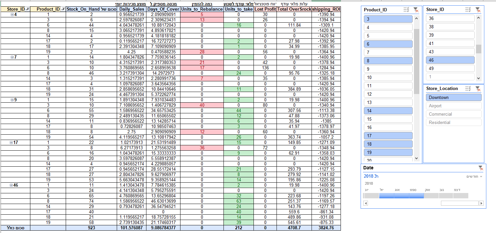

# Maven Toys Mexico — Strategic Inventory Optimization & Rebalancing Model

## Project Context
This project analyzes sales and inventory data for Maven Toys Mexico, a fictional 50-store toy retail chain, with the objective of identifying operational inefficiencies and enabling smarter inventory decisions.

The dataset consists of four core tables: `sales`, `products`, `inventory`, and `stores`, and the analytical task includes:
- assessing high-profit products and store performance,
- identifying seasonal demand and stockout risk,
- estimating capital tied up in inventory,
- building a practical inventory rebalancing solution.

## Proposed Smart Inventory Solution
I designed a smart inventory management model that combines demand profiling with dynamic inter-store rebalancing.

Key elements of the solution:
- **Demand-driven inventory targets:** calculate daily sales rates per store and SKU using Q3 2017 and Q3 2018 sales.
- **Days of Supply monitoring:** classify inventory status into Shortage, Healthy, or Overstock based on current stock levels and demand velocity.
- **Rebalancing engine:** identify overstock locations and route excess inventory to nearby stores experiencing shortages for the same SKU.
- **Excel-based Proof of Concept:** an operational model built in Excel, supported by a visual inventory flow diagram and a documented logic rationale.

*Visual summary of the Excel-based inventory rebalancing model, showing the flow from excess stock detection to targeted transfer and shortage mitigation.*

This approach shifts the focus from buying more inventory to using existing inventory more efficiently, recovering lost revenue while freeing up working capital.

## Analytical Findings
- **Dual imbalance:** the network showed both stockout risk in high-velocity products and capital stagnation in slow-moving inventory.
- **Demand misalignment:** fixed replenishment cycles did not reflect differences between Downtown and residential store footprints.
- **High-impact SKU focus:** a Pareto-style analysis highlighted a small set of products driving the majority of revenue and risk.

## Alignment to Project Objectives
This solution is designed to match the task requirements from the project brief:
- **Identify top profit products and store variation:** the analysis isolates high-impact SKUs and compares performance by store footprint.
- **Analyze seasonal trends:** Q3 demand profiling reveals operational seasonality and translates it into daily run-rate metrics.
- **Detect lost sales from out-of-stock:** the Days of Supply logic directly flags shortages and supports mitigation through internal transfers.
- **Quantify capital tied in inventory:** the model estimates trapped capital in overstocked SKUs and shows how rebalancing releases liquidity.

## Solution Benefits
- **Revenue protection:** reduced stockout exposure for high-demand items.
- **Capital release:** freed cash from excess inventory by returning it to productive locations.
- **Operational leverage:** enabled a logistics-aware, internal transfer strategy instead of incremental purchasing.

## Repo Contents
- `BQ.txt` — BigQuery SQL for demand benchmarking, inventory health checks, and Downtown rebalancing analysis.
- `MexicoToysPresentation2.pdf` — project presentation with findings and recommendations.
- `model.png` — visual diagram of the Excel-based inventory rebalancing model.
